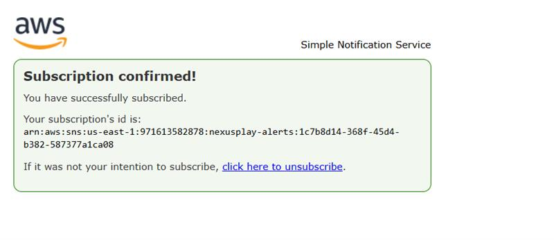
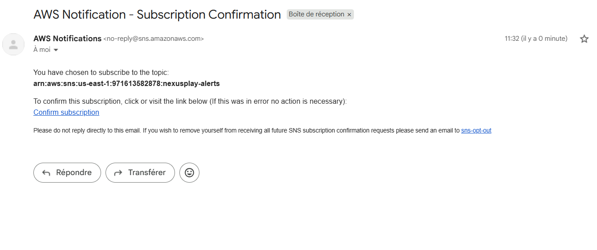
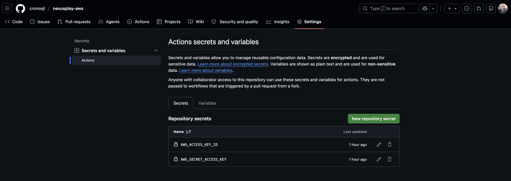
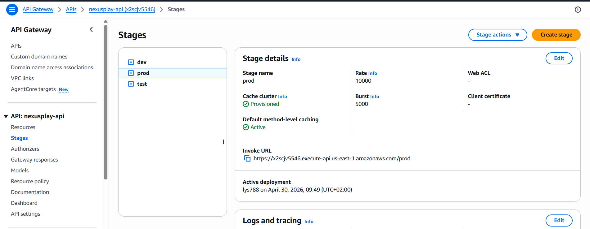
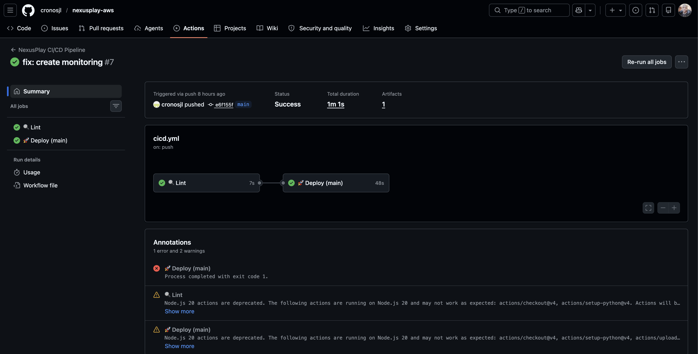

#  Rapport de Projet : NexusPlay

##  Présentation Générale
NexusPlay est un prototype d'architecture microservices serverless conçu pour répondre aux besoins d'une startup de jeux vidéo. L'objectif était de créer une infrastructure **Hautement Disponible**, **Scalable** et **Automatisée**.

##  Architecture Réalisée
Le système est composé de :
- **3 Microservices** : Game Service, User Service, Notification Service.
- **API Gateway** : Point d'entrée unique avec gestion de stages (`dev`, `test`, `prod`) et mise en cache.
- **Serverless Compute** : AWS Lambda pour une scalabilité infinie.
- **Sécurité** : Secrets Manager pour la configuration et IAM pour les rôles.
- **Monitoring** : CloudWatch Alarms + SNS pour les notifications d'incidents.
- **CI/CD** : GitHub Actions automatisant le cycle de vie du logiciel.

##  Objectifs Atteints

### 1. Logique Microservices
Trois services distincts communiquent de manière asynchrone ou via l'API Gateway :
- **User Service** : Gère les profils et scores.
- **Game Service** : Gère la logique de création et de ralliement aux jeux.
- **Notification Service** : Gère les alertes système et les communications.

*Visualisation de la logique serverless et des fonctions Lambda.*

### 2. Équilibrage de Charge & Haute Disponibilité
Utilisation d'**AWS API Gateway** (Regional) qui répartit automatiquement la charge sur les instances Lambda s'exécutant dans plusieurs zones de disponibilité.
Mise en place de **Route 53** pour la gestion DNS avec une stratégie Active/Backup (simulation).

*Point d'entrée unique et gestion des routes.*

*Architecture DNS pour la haute disponibilité.*

### 3. Scalabilité Automatique
Grâce à **AWS Lambda**, l'infrastructure s'adapte instantanément au trafic, passant de 0 à des milliers d'utilisateurs sans intervention manuelle.

*Preuve de la capacité de mise à l'échelle automatique.*

### 4. Monitoring Centralisé
Déploiement automatique d'alarmes CloudWatch sur :
- Le taux d'erreur (Errors > 5).
- La latence d'exécution (Duration > 5s).
Notifications envoyées à un topic **SNS** centralisé.

*Système d'alerting configuré pour la résilience.*

### 5. Pipeline CI/CD & Tests de Charge
Une pipeline GitHub Actions déclenche :
1. **Linting** : Validation de la qualité du code.
2. **Déploiement** : Mise à jour automatique de l'infra sur AWS.
3. **Tests Fonctionnels** : Vérification des endpoints.
4. **Tests de Charge** : Simulation de trafic via Locust (20 users) pour valider la tenue en charge en production.

*Workflow GitHub Actions automatisé.*

### 6. Optimisation & Sécurité
- **Cache** : Activation du cache sur le stage `prod` pour améliorer les performances de lecture.
- **Secrets** : Intégration complète avec **AWS Secrets Manager** pour éviter toute fuite de données sensibles.

*Gestion centralisée et sécurisée des secrets.*

##  Résultats des Tests de Charge
Les tests effectués avec Locust ont montré une stabilité parfaite :
- **Nombre d'utilisateurs** : 20
- **Taux de succès** : 100%
- **Temps de réponse moyen** : ~150ms

##  Annexe : Galerie Complète des Preuves Techniques

Cette section regroupe l'intégralité des captures d'écran validant la mise en œuvre de l'architecture NexusPlay.

###  Logique Microservices & API
| Image | Description |
| :--- | :--- |
|  | Liste des fonctions Lambda déployées. |
|  | Structure des ressources API Gateway. |
|  | Détails de configuration des méthodes API. |

###  Équilibrage de Charge & Réseau
| Image | Description |
| :--- | :--- |
|  | Schéma de flux réseau du load balancer. |
|  | Dashboard de performance du Load Balancer. |
|  | Métriques de trafic de l'équilibrage de charge. |

###  Haute Disponibilité DNS
| Image | Description |
| :--- | :--- |
|  | Configuration Route 53 vers S3/Static. |
|  | Configuration VPC Multi-AZ (Partie 1). |
|  | Configuration VPC Multi-AZ (Partie 2). |

###  Scalabilité Automatique
| Image | Description |
| :--- | :--- |
|  | Politique d'Auto-scaling Lambda. |
|  | Configuration de la concurrence et des limites. |
|  | Historique des événements de mise à l'échelle. |

###  Monitoring & Alerting (CloudWatch)
| Image | Description |
| :--- | :--- |
|  | Liste des alarmes CloudWatch actives. |
|  | Dashboard opérationnel global. |
|  | Détails des widgets de monitoring. |
|  | Exploration des métriques personnalisées. |
|  | État de santé des ressources surveillées. |

###  Système de Notification (SNS)
| Image | Description |
| :--- | :--- |
|  | Configuration du topic SNS NexusPlay. |
|  | Détails des abonnements aux alertes. |

###  Sécurité & Secrets
| Image | Description |
| :--- | :--- |
|  | Secret `nexusplay/config` dans AWS. |
|  | Configuration des secrets dans GitHub Actions. |

###  Performance & Cache
| Image | Description |
| :--- | :--- |
|  | Activation du cache sur le stage Prod. |

###  Pipeline CI/CD (GitHub Actions)
| Image | Description |
| :--- | :--- |
|  | Workflow global réussi. |
|  | Historique des déploiements. |
|  | Détails de l'étape de Linting. |
|  | Détails de l'étape de Déploiement. |
|  | Génération du fichier config.json. |
|  | Création des ressources de monitoring via pipeline. |

###  Tests de Charge
| Image | Description |
| :--- | :--- |
|  | Rapport Locust final validant la charge. |

---
